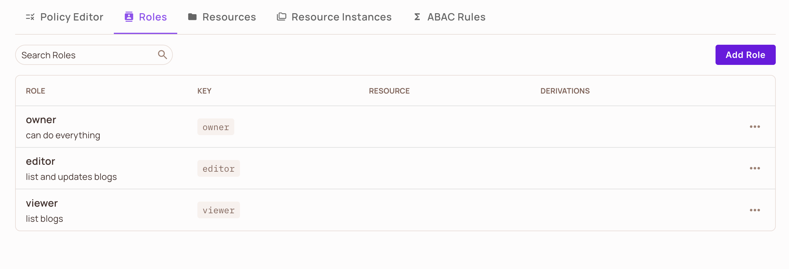
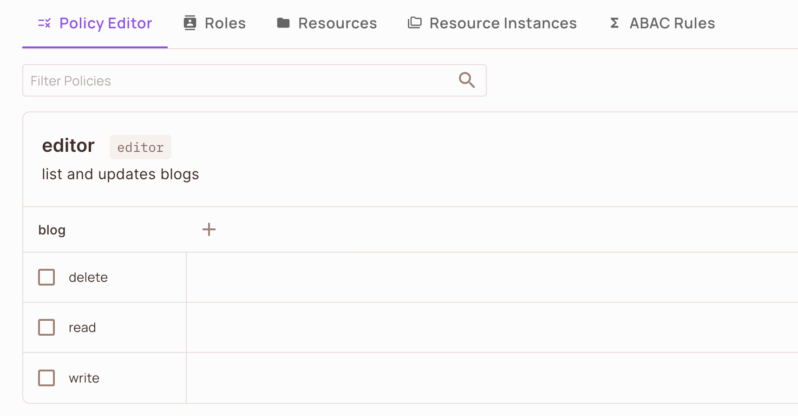
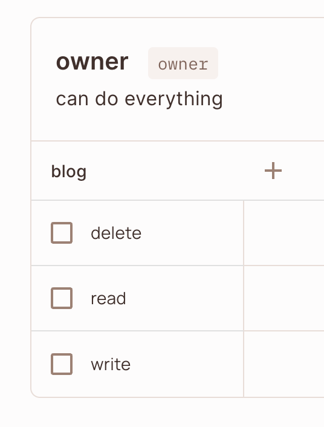
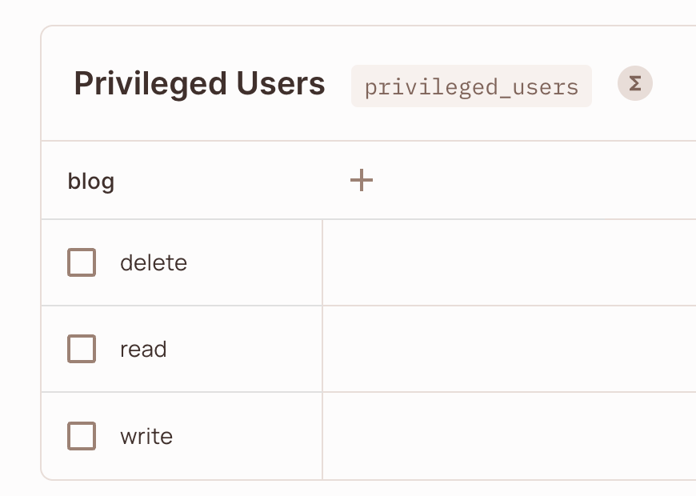
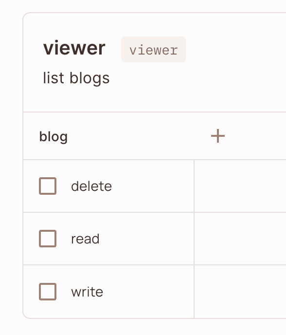

# Permit.io Go application example

##  Prerequisites

- [Terraform](https://developer.hashicorp.com/terraform/downloads) >= 1.0
- [Go](https://golang.org/doc/install) >= 1.19

### init

From the application folder:

```sh
go mod tidy
go run main.go
```

The app server will listen on port 8080
You can reach out and verify it is up and running: http://localhost:8080/

### PDP installation
PDP is the component that will enforcement the policies and on every permit.check command will contact with permit.io to check policies and data configuration.
In order to run it, please run the following Docker command:

```sh
docker run -p 7766:7000 --env PDP_API_KEY=<API_KEY> --env PDP_DEBUG=true permitio/pdp-v2:latest
```
The PDP will run internally on port 7000 and will export port 7766 outside

The PDP configure at the app will looks like the following:

```go
permitConfig := config.NewConfigBuilder(
		"<API_KEY>").
		WithPdpUrl("http://localhost:7766").
		Build()
```
In order to make sure that the PDP is up and running, please look at logs, for example:

2024-02-22 08:50:22.147 | 29514 | INFO     | opal_client.opa.logger:log_entire_dict:89 - Logs uploaded successfully. {"plugin": "decision_logs", "time": "2024-02-22T08:50:22Z"}

### Configure terraform provider
```hcl
terraform {
  required_providers {
    permitio = {
      source  = "permitio/permit-io"
      version = "~> 0.0.1"
    }
  }
}

provider "permitio" {
    api_url = "https://api.permit.io" # Defaults to - "https://api.permit.io - Can be set as an environment variable PERMITIO_API_URL
    api_key = "YOUR_API_KEY" # Can be set as an environment variable PERMITIO_API_KEY
}
```

Now please run the terraform file in order to create the policies and roles:

```sh
terraform init
terraform plan
terraform apply
```
Example screenshots of the expected state after terraform apply:







All Set! Go to permit.io to 'Policy' tab and verify that policies and roles are there there and fill them according to your wish.
If so, lets begin! open terminal:

```sh
curl -X POST -H "Content-Type: application/json" -d '{"name": "permit1"}' http://localhost:8080/signup
curl -X POST -H "Content-Type: application/json" -d '{"name": "permit2"}' http://localhost:8080/signup
curl -X POST -H "Content-Type: application/json" -d '{"name": "permit3"}' http://localhost:8080/signup
```
Now go to Permit.io and check under 'Directory' tab that you able to see all the new users, if you're not see them please verify that you're on 'All Tenants' and not under 'Default Tenant'.

Here are few curl commands in order to check the policy enforcement:

## Request:
```sh
curl -X POST -d '{"user_name":"permit1","name":"My_New_Blog"}' http://localhost:8080/blogs
```
## Response:
'New blog created successfully' for success
'Access denied' for unsuccess

## Request:
```sh
curl -X DELETE -d '{"user_name":"permit1"}' http://localhost:8080/blogs/permit_blog1
```
## Response:
'Blog with ID permit_blog1 deleted successfully' for success
'Access denied' for unsuccess


## Request:
```sh
curl -X GET -d '{"user_name":"permit2"}' http://localhost:8080/blogs
```
## Response:
'["blog1","blog2","blog3"]' for success
'Access denied' for unsuccess


## Request:
```sh
curl -X POST -d '{"user_name":"permit3"}' http://localhost:8080/transfer_payment_for_blog
```
## Response:
'Payment transferred successfully for blog' for success
'Access denied' for unsuccess


